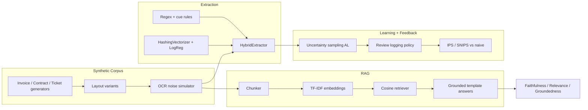

# doc-intel-factory

**Enterprise document-intelligence factory** (DS + applied LLM systems lab): synthetic documents → layout/OCR-like text → hybrid extraction → RAG with faithfulness/relevance eval → active learning → human-feedback off-policy evaluation.

One coherent system story for staff DS / applied LLM interviews and teaching — **not** a production OCR stack or hosted LLM product.

## Architecture



| Module | Path | Role |
|--------|------|------|
| Synthetic corpus | `doc_intel_factory/synthetic/` | Invoices, contracts, tickets; layouts; OCR noise |
| Extraction | `doc_intel_factory/extraction/` | Rule+ML hybrid IE; P/R/F1 |
| RAG | `doc_intel_factory/rag/` | Chunking, TF-IDF, retrieval, grounded answers |
| Eval | `doc_intel_factory/eval/` | Faithfulness, relevance, groundedness harness |
| Active learning | `doc_intel_factory/active_learning/` | Uncertainty vs random budget curves |
| Feedback OPE | `doc_intel_factory/feedback_ope/` | Review logging policy; IPS/SNIPS |
| Pipeline CLI | `doc_intel_factory/pipeline/` | End-to-end run → `artifacts/factory_report.md` |
| Dashboard | `app/streamlit_app.py` | Optional ops view |

## Quickstart

```bash
python -m venv .venv && source .venv/bin/activate
pip install -e ".[dev]"
pytest -q
doc-intel-factory run --n-docs 300 --seed 42
# optional dashboard
pip install -e ".[dashboard]"
streamlit run app/streamlit_app.py
```

Case studies:

```bash
PYTHONPATH=src python -m case_studies.study_a
PYTHONPATH=src python -m case_studies.study_b
PYTHONPATH=src python -m case_studies.study_c
```

## Case studies (story)

| ID | Question | What you see |
|----|----------|--------------|
| **A** | Does hybrid IE beat rules under OCR noise? | F1 lift on held-out synthetic gold |
| **B** | Are RAG answers faithful & relevant? | Faithfulness, groundedness, hit@5, MRR |
| **C** | Is uncertainty AL worth the label budget? Does OPE beat naive for review policy? | AL curve + IPS/SNIPS vs oracle |

## Design notes

- **OCR**: character confusions, deletions, spacing/line-break glitches — no Tesseract.
- **Extraction**: regex candidates + `HashingVectorizer` logistic scoring; distant supervision from gold values.
- **RAG**: sklearn TF-IDF + cosine; answers are **template-grounded** on retrieved spans (no API keys).
- **AL**: document-level uncertainty = mean(1 − field confidence); compare to random sampling.
- **OPE**: logging policy routes uncertain docs to “human review”; IPS/SNIPS estimate a threshold target policy; rewards are oracle-simulated from auto-extract error.

## Threats to validity

1. Synthetic noise ≠ real scanner/OCR distributions.
2. Template answers overestimate faithfulness vs free-form LLMs.
3. OPE rewards assume known oracle error; real review quality/cost differ.
4. Small TF-IDF index; not multilingual dense retrieval.
5. Field matching uses fuzzy normalization — optimistic under heavy noise.

## What this is NOT

- **Not** production OCR, PDF layout models, or Document AI APIs.
- **Not** a hosted LLM / agent platform.
- **Not** a claim of SOTA IE or RAG benchmarks — it is a **lean, testable systems lab**.

## License

MIT © 2026 Rohith Vairavel
